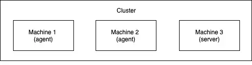

## Kubernetes Cluster Overview

A **cluster** is a group of machines (called **nodes**) that work together to run containerized applications.

- **Node cluster**: At minimum, consists of one machine hosting the **Kubernetes control plane**.
- **Kubernetes control plane**: Exposes the API and manages the cluster.
- **Cluster scalability**: Supports up to 5,000 nodes.

### Node Types

- **Server node**: Runs the control plane components.
- **Agent node**: Does not run control plane components.

 

  

## What is a Pod?

A **Pod** is the smallest deployable unit in Kubernetes and represents an abstraction over one or more containers. Pods provide a shared context for their containers, allowing them to share storage volumes, network IP, and port space. This setup enables tightly coupled application components to communicate efficiently.

- **Pod as a container of containers**: Multiple containers in a pod share resources and are managed as a single entity.
- **Lifecycle**: If containers in a pod stop running, the pod is deleted and any data stored in ephemeral storage is lost.
- **Use case**: Typically, a pod runs a single application container, but can also include helper containers (sidecars) for supporting tasks.

Pods simplify deployment and management of containerized applications by grouping related containers together.
